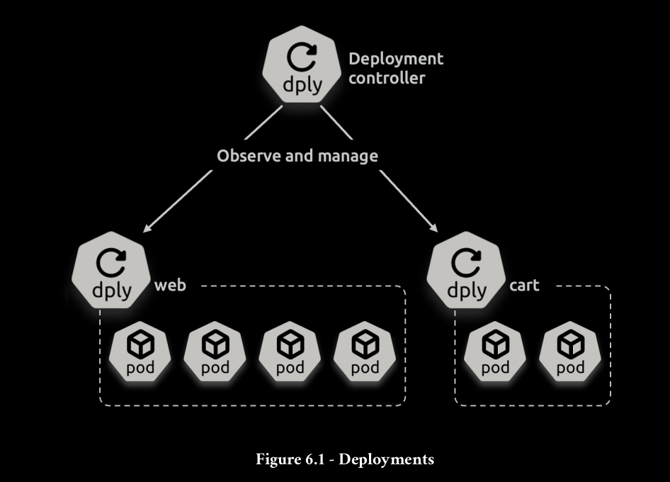

The Deployment resource exists in the apps/v1 [API](https://kubernetes.io/docs/reference/generated/kubernetes-api/v1.28/#create-deployment-v1-apps) and defines all supported attributes and capabilities.

The Deployment controller runs on the control plane, watches Deployments, and reconciles observed state with desired state.



```bash
apiVersion: apps/v1
kind: Deployment
metadata:
  name: hello-deploy
spec:
  replicas: 10
  selector:
    matchLabels:
      app: hello-world
  revisionHistoryLimit: 5
  progressDeadlineSeconds: 300
  minReadySeconds: 10
  strategy:
    type: RollingUpdate
    rollingUpdate:
      maxUnavailable: 1
      maxSurge: 1
  template:
    metadata:
      labels:
        app: hello-world
    spec:
      containers:
      - name: hello-pod
        image: nigelpoulton/k8sbook:1.0
        ports:
        - containerPort: 8080
        resources:
          limits:
            memory: 128Mi
            cpu: 0.1
---
apiVersion: v1
kind: Service
metadata:
  name: hello-svc
  labels:
    app: hello-world
spec:
  ports:
  - port: 80
    targetPort: 8080
    protocol: TCP
  selector:
    app: hello-world
---
apiVersion: networking.k8s.io/v1
kind: Ingress
metadata:
  name: hello-svc

spec:
  ingressClassName: traefik
  rules:
  - host: localhost 
    http:
      paths:
      - path: /
        pathType: Prefix
        backend:
          service:
            name: hello-svc
            port:
              number: 80
```

