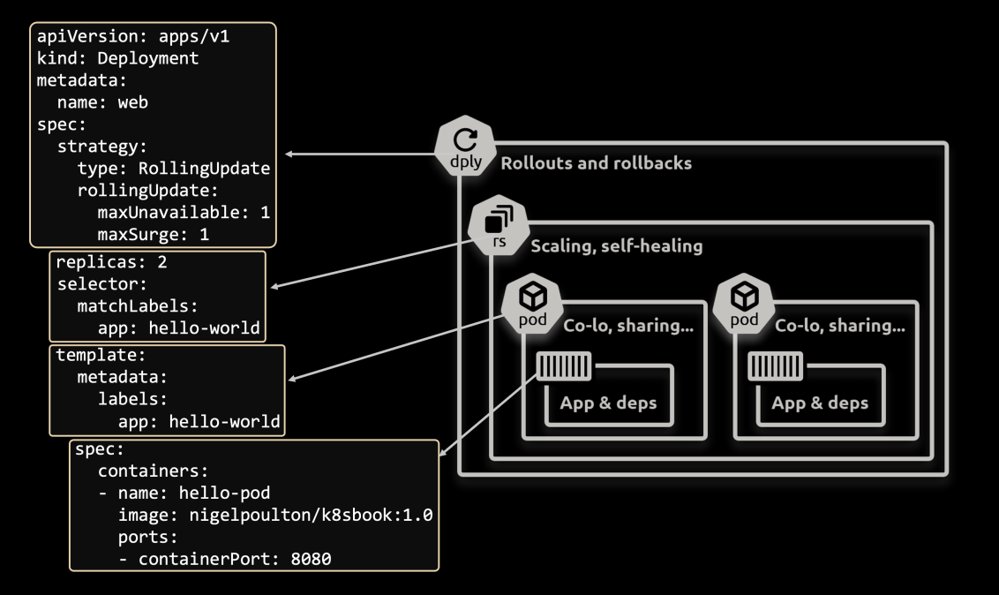

The Horizontal Pod Autoscaler (HPA) adds and removes Pods to meet current demand.
Most clusters install it by default, and it’s widely used.

The Cluster Autoscaler (CA) adds and removes cluster nodes so you always have enough
to run all scheduled Pods. This is also installed by default and widely used.

**Multi-dimensional autoscaling:** This is jargon for combining multiple scaling methods — scaling Pods and nodes, or scaling apps
horizontally (adding more Pods) and vertically (adding more resources to existing Pods).
