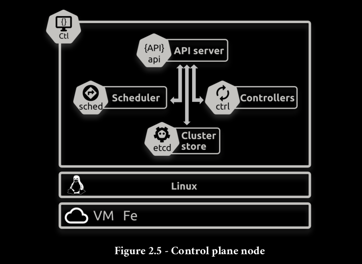
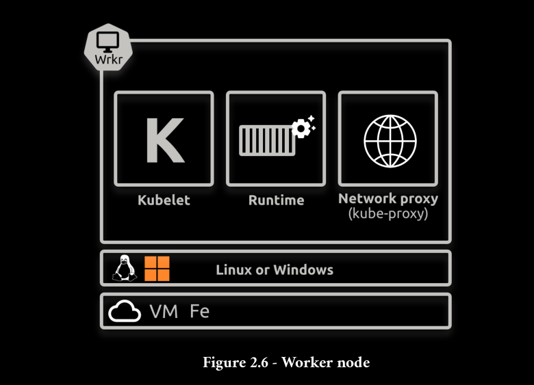
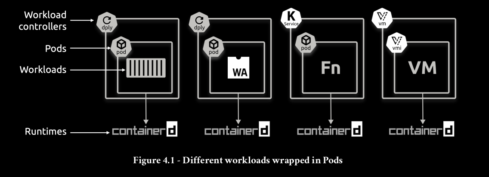
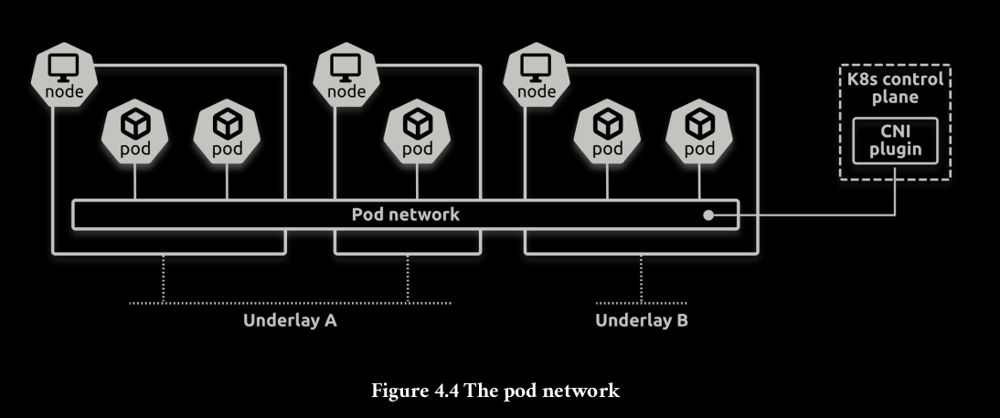

# Local kubernetes cluster

For testing pupose, you can use [k3d](https://github.com/k3d-io/k3d):

```bash
k3d cluster create k8s-test \
  --servers 3 \
  --agents 3 \
  -p "80:80@loadbalancer" \
  -p "443:443@loadbalancer" \
  --k3s-node-label "type=control@server:0,1,2" \
  --k3s-node-label "type=worker@agent:0,1,2"
```

## Cluster overview









## Control Plane Components

The control plane's components make global decisions about the cluster (for example, scheduling), as well as detecting and responding to cluster events (for example, starting up a new pod when a Deployment's replicas field is unsatisfied).
Control plane components can be run on any machine in the cluster. However, for simplicity, setup scripts typically start all control plane components on the same machine, and do not run user containers on this machine. See Creating Highly Available clusters with kubeadm for an example control plane setup that runs across multiple machines.

### kube-apiserver
The API server is a component of the Kubernetes control plane that exposes the Kubernetes API. The API server is the front end for the Kubernetes control plane.

The main implementation of a Kubernetes API server is kube-apiserver. kube-apiserver is designed to scale horizontally—that is, it scales by deploying more instances. You can run several instances of kube-apiserver and balance traffic between those instances.

### etcd
Consistent and highly-available key value store used as Kubernetes' backing store for all cluster data.
If your Kubernetes cluster uses etcd as its backing store, make sure you have a back up plan for the data.
You can find in-depth information about etcd in the official [documentation](https://etcd.io/docs/).

### kube-scheduler
Control plane component that watches for newly created Pods with no assigned node, and selects a node for them to run on.
Factors taken into account for scheduling decisions include: individual and collective resource requirements, hardware/software/policy constraints, affinity and anti-affinity specifications, data locality, inter-workload interference, and deadlines.

### kube-controller-manager
Control plane component that runs controller processes.
Logically, each controller is a separate process, but to reduce complexity, they are all compiled into a single binary and run in a single process.
There are many different types of controllers. Some examples of them are:

- Node controller: Responsible for noticing and responding when nodes go down.
- Job controller: Watches for Job objects that represent one-off tasks, then creates Pods to run those tasks to completion.
- EndpointSlice controller: Populates EndpointSlice objects (to provide a link between Services and Pods).
- ServiceAccount controller: Create default ServiceAccounts for new namespaces.

The above is not an exhaustive list.

### cloud-controller-manager
A Kubernetes control plane component that embeds cloud-specific control logic. The cloud controller manager lets you link your cluster into your cloud provider's API, and separates out the components that interact with that cloud platform from components that only interact with your cluster.
The cloud-controller-manager only runs controllers that are specific to your cloud provider. If you are running Kubernetes on your own premises, or in a learning environment inside your own PC, the cluster does not have a cloud controller manager.

As with the kube-controller-manager, the cloud-controller-manager combines several logically independent control loops into a single binary that you run as a single process. You can scale horizontally (run more than one copy) to improve performance or to help tolerate failures.

The following controllers can have cloud provider dependencies:

- Node controller: For checking the cloud provider to determine if a node has been deleted in the cloud after it stops responding
- Route controller: For setting up routes in the underlying cloud infrastructure
- Service controller: For creating, updating and deleting cloud provider load balancers


## Node Components
Node components run on every node, maintaining running pods and providing the Kubernetes runtime environment.

### kubelet
An agent that runs on each node in the cluster. It makes sure that containers are running in a Pod.
The kubelet takes a set of PodSpecs that are provided through various mechanisms and ensures that the containers described in those PodSpecs are running and healthy. The kubelet doesn't manage containers which were not created by Kubernetes.

### kube-proxy
kube-proxy is a network proxy that runs on each node in your cluster, implementing part of the Kubernetes Service concept.
kube-proxy maintains network rules on nodes. These network rules allow network communication to your Pods from network sessions inside or outside of your cluster.
kube-proxy uses the operating system packet filtering layer if there is one and it's available. Otherwise, kube-proxy forwards the traffic itself.

### Container runtime
A fundamental component that empowers Kubernetes to run containers effectively. It is responsible for managing the execution and lifecycle of containers within the Kubernetes environment.

Kubernetes supports container runtimes such as containerd, CRI-O, and any other implementation of the Kubernetes CRI (Container Runtime Interface).
