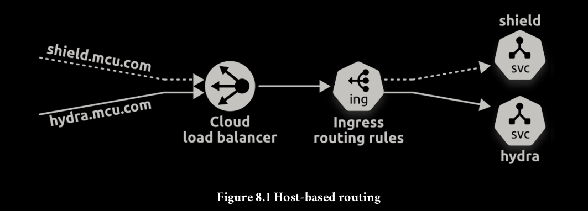

Ingress expose multiple Services through a single cloud load
balancer.
It does this by creating a single cloud load balancer on port 80 or 443 and using host-
based and path-based routing to map connections to different Services on the cluster.

