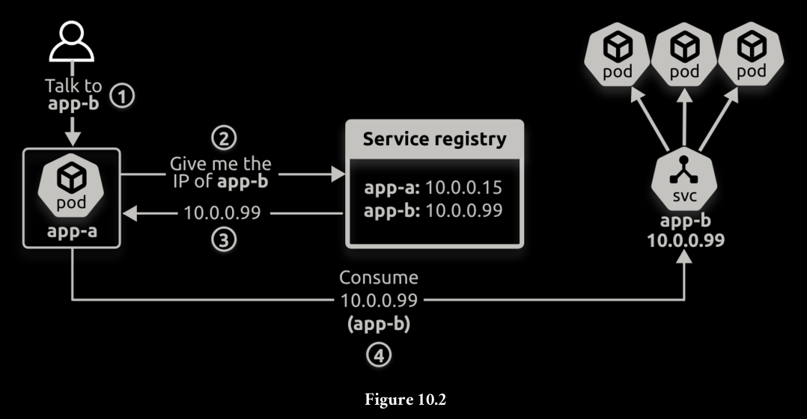
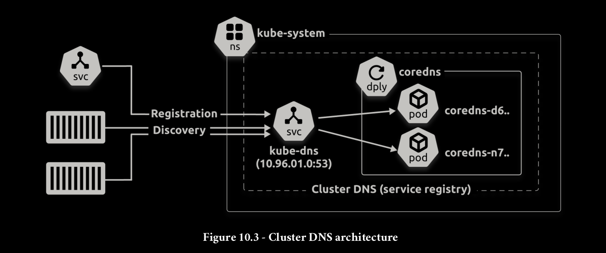
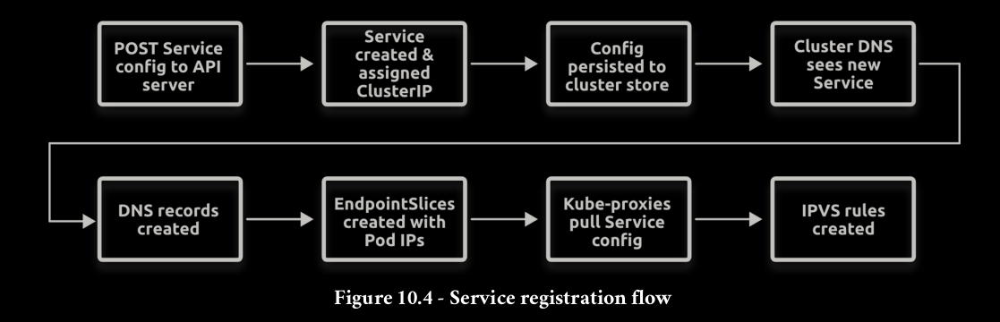
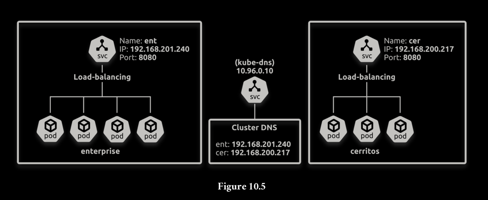

Apps need two things to be able to send requests to other apps:
1. A way to know the name of the other app (the name of its Service)
2. A way to convert the name into an IP address



Every Kubernetes cluster has a built-in cluster DNS that it uses as its service registry.
It’s a Kubernetes-native application running on the control plane of every Kubernetes
cluster as two or more Pods managed by a Deployment and fronted by a Service. The
Deployment is usually called coredns or kube-dns, and the Service is always called
kube-dns.



```bash
kubectl get pods -n kube-system -l k8s-app=kube-dns
kubectl get deploy -n kube-system -l k8s-app=kube-dns
kubectl get svc -n kube-system -l k8s-app=kube-dns
```



You post a new Service resource manifest to the API server, where it’s authenticated
and authorised. Kubernetes allocates it a ClusterIP and persists its configuration to the
cluster store. The cluster DNS observes the new Service and registers the appropriate
DNS A and SRV records. Associated EndpointSlice objects are created to hold the list of
healthy Pod IPs that match the Service’s label selector. Every node runs a kube-proxy
that observes the new objects and creates local routing rules so that requests to the
Service’s ClusterIP get routed to Pods.




## Debug

A common way to test if the cluster DNS is working is to use nslookup to resolve the
kubernetes Service.

```bash
kubectl run -it dnsutils \
--image registry.k8s.io/e2e-test-images/jessie-dnsutils:1.7
```
