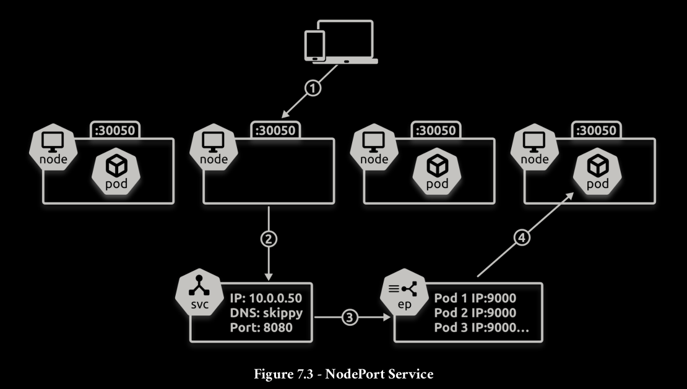
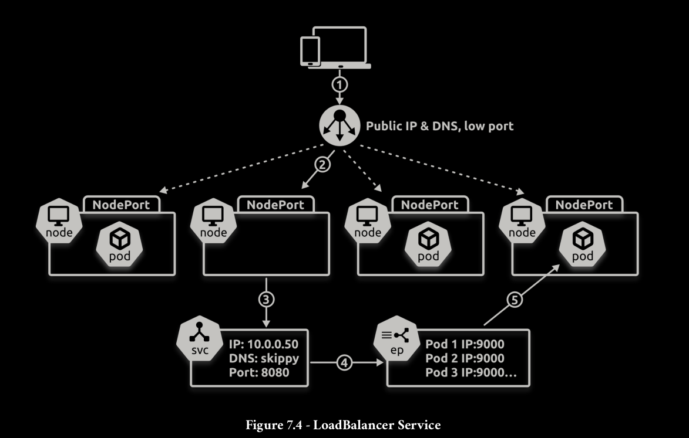

Kubernetes has several types of Services for different use cases and requirements. The major ones are:

- ClusterIP
- NodePort
- LoadBalance





```bash
---
apiVersion: apps/v1
kind: Deployment
metadata:
  name: svc-test
spec:
  replicas: 10
  selector:
    matchLabels:
      chapter: services
  template:
    metadata:
      labels:
        chapter: services
    spec:
      containers:
      - name: hello-ctr
        image: nigelpoulton/k8sbook:1.0
        ports:
        - containerPort: 8080
---
apiVersion: v1
kind: Service
metadata:
  name: cloud-lb
spec:
  type: LoadBalancer
  ports:
  - port: 9000
    targetPort: 8080
  selector:
    chapter: services
```

```bash
apiVersion: v1
kind: Service
metadata:
  name: svc-test
  labels:
    chapter: services
spec:
  ipFamilyPolicy: PreferDualStack
  ipFamilies:
    - IPv4
    - IPv6
  type: NodePort
  ports:
    - port: 8080
      nodePort: 30001
      targetPort: 9090
      protocol: TCP
  selector:
    chapter: services
```
