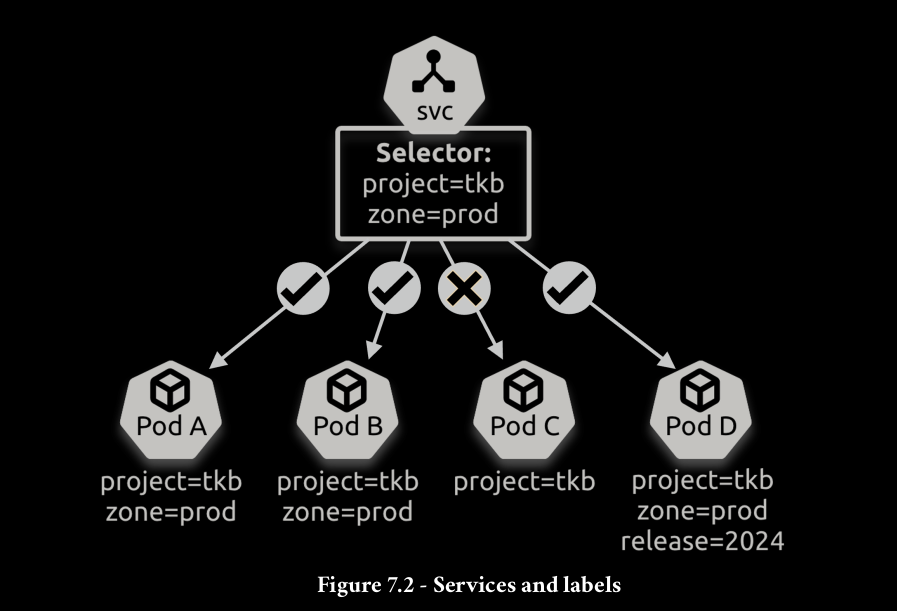

Services use labels and selectors to know which Pods to send traffic to. This is the same technology that loosely couples Deployments to Pods.

You create a Service, and the EndpointSlice controller automatically creates an associated
EndpointSlice object. Kubernetes then watches the cluster, looking for Pods matching
the Service’s label selector. Any new Pods matching the selector are added to the
EndpointSlice, whereas any deleted Pods get removed. Applications send traffic to the
Service name, and the application’s container uses the cluster DNS to resolve the name
to an IP address. The container then sends the traffic to the Service’s IP, and the Service
forwards it to one of the Pods listed in the EndpointSlice.
