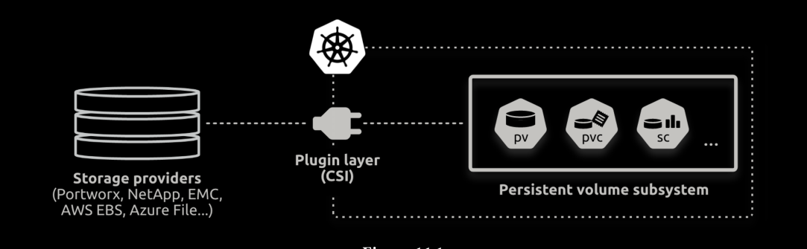

Container Storage Interface is an open-source project that defines an industry-standard interface 
so container orchestrators can leverage external storage resources in a uniform way. 
For example, it gives storage providers a documented interface to work with. It also means
that CSI plugins should work on any orchestration platform that supports the CSI.

You can find a relatively up-to-date list of CSI plugins in the following repository. The
repository refers to plugins as drivers.

```bash
https://kubernetes-csi.github.io/docs/drivers.html
```


