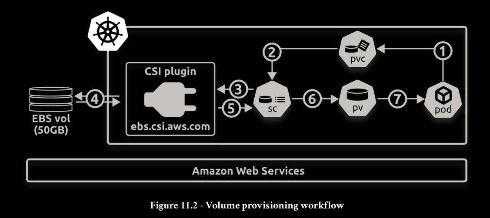

Persistent Volume Subsystem is a standardized set of API objects that make it easy for applications running on Kubernetes
to consume storage. There are a growing number of storage-related API objects, but the
core ones are:

- PersistentVolumes (PV)
- PersistentVolumeClaims (PVC)
- StorageClasses (SC)

1. The Pod needs a volume and requests it via a PersistentVolumeClaim
2. The PVC asks the StorageClass to create a new PV and associated volume on the
AWS backend
3. The SC makes the call to the AWS backend via the CSI plugin
4. The CSI plugin creates the device (50GB EBS volume) on AWS
5. The CSI plugin reports the creation of the external volume back to the SC
6. The SC creates the PV and maps it to the EBS volume on the AWS back end
7. The Pod mounts the PV and uses it

